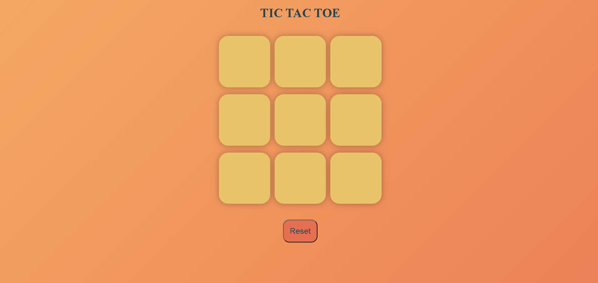

# 🎯 Tic Tac Toe Game

## 📝 Description

**Tic Tac Toe** is a classic 2-player game where players take turns marking the spaces in a 3×3 grid with "X" or "O". The player who succeeds in placing three of their marks in a horizontal, vertical, or diagonal row wins the game.

This project is a **browser-based implementation**, created using **HTML, CSS, and JavaScript**. It is ideal for beginners looking to improve their frontend development skills.

---

## 💡 Features

- ✅ Two-player mode
- ✅ Win detection and draw handling
- ✅ Stylish, responsive UI
- ✅ "New Game" and "Reset" options

---

## 📸 Screenshot

---

## 🛠️ Technologies Used

- HTML
- CSS
- JavaScript

---

## 🧠 Learning Outcomes

- DOM Manipulation
- Event Handling
- Responsive Design
- Game Logic Implementation

---

## 🚀 Deployment

This game can be deployed on GitHub Pages, Netlify, or Vercel.

---

## 🔧 Enhancements Ideas

- Add AI mode
- Score tracking system
- Sound effects
- Custom themes

---

## 👤 Author

**Tayyab Arshad**  
🔗 GitHub: [Tayyab-arshad118](https://github.com/Tayyab-arshad118)

---

## 📄 License

Licensed under the MIT License.
